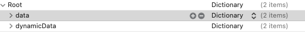

# PlistDat_lib

est une librairie permettant de gérer les property d'un projet depuis un fichier plist et d'en assurer la permanence.

<u>**UTILISATION**</u>

**ex: créez un fichier plist (game.plist par exemple)*

y ajouter (obligatoirement) 2 entrées de type dictionary data et dynamicData servant respectivement à recevoir les var (data) et les let(dynamicData)

dans le ViewController (ou autre classe) apès avoir importé la laibrairie : import plistData

initialisez une varieble de type PLD_class
`var  PLD_obj : PLD_class?`
`PLD_obj = PLD_class(fileName:"game")`

puis créer une variable  var1 du type que vous souhaitez :

var v1:Int = 8
et mettez a jour le fichier plist
PLD_obj!.dynamicData["v1"] = v1 as AnyObject
 La variable v1 est désormais concervée dans le fichier plist
